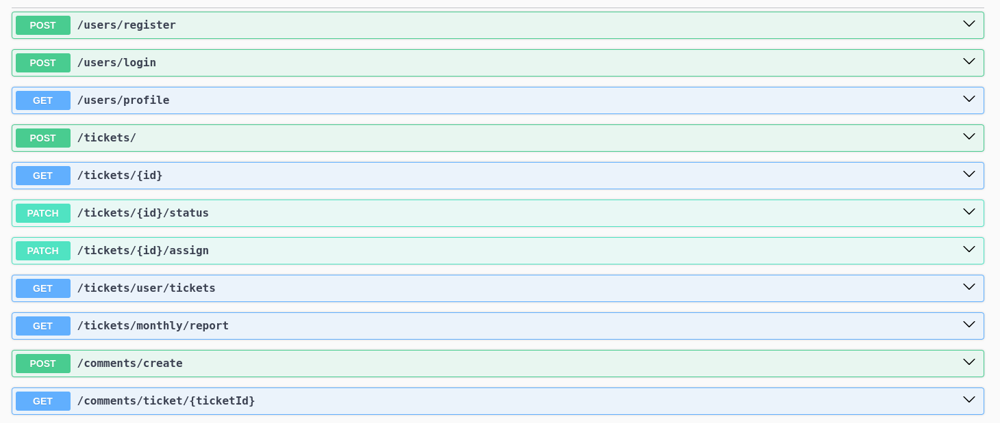

# Customer Support Ticketing System

This project is a customer support ticketing system designed to facilitate the process of handling customer support requests. Built with Node.js, Express and MongoDB it offers a robust backend solution for managing tickets, users, and comments efficiently.

## Endpoints



## Features

- **Customer Features:**

  - Create support requests.
  - View the status of previous requests.
  - Comment on a support request.

- **Support Agent Features:**

  - Comment on support requests.
  - Update the ticket status

- **Admin Features:**

  - Add users to the system

- **Authentication:**

  - JWT-based authentication for users.

## Prerequisites

- [Node.js](https://nodejs.org/en)
- [Mongoose](https://www.npmjs.com/package/mongoose)

## Installation

1. Clone the repository:

```
git clone https://yourrepositoryurl.git
```

2. Install dependencies:

```
cd project_folder
npm install
```

3. Set up your `.env` file based on the `.env.example` provided in the repository.

4. Create seed data for testng.

```
npm seed
```

5. Start the server:

```
nodemon
```

## Usage

The system is designed to be interacted with through its REST API endpoints:

- **Creating a New User (Admin):**
  POST `users/register` with the necessary ticket user information i.e username, password, email, role.

- **Assign ticket (Admin):**
  POST `tickets/:id/assign` with the agentId and Ticket Id.

- **Creating a support request (Customer):**
  POST `/tickets` with the necessary ticket information.

- **Viewing User tickets (Support Agent):**
  GET `tickets/user/tickets` to retrieve a list of user tickets.

- **Commenting on a ticket (Customer/Support Agent):**
  POST `/comments/create` with the ticket ID and comment content.

- **Update ticket Status (Support Agent):**
  POST `tickets/:id/status` with the ticket ID and status.

- **Get a comment for a specific ticket (Custoner/Admin/Support Agent):**
  POST `tickets/ticket/:ticketId` with the ticket ID and status.

## Testing

To run the automated tests, use:

```
npm test
```

## Technologies Used

- Backend: Node.js, Express
- Database: MongoDB with Mongoose
- Authentication: JWT
- Testing: Jest (unit tests)

## Contributing

Contributions are welcome! Please feel free to submit a pull request or open an issue for discussion.

## License

This project is licensed under the ISC License. See the LICENSE file for details.

## Acknowledgments

- Node.js and Express for the backend framework.
- MongoDB and Mongoose for database management.
- The JavaScript communities for continuous support and inspiration.

## FeedBack

You can make it a Test Driven Development where there tests cases are already provided and one writes the code to pass the test cases.
